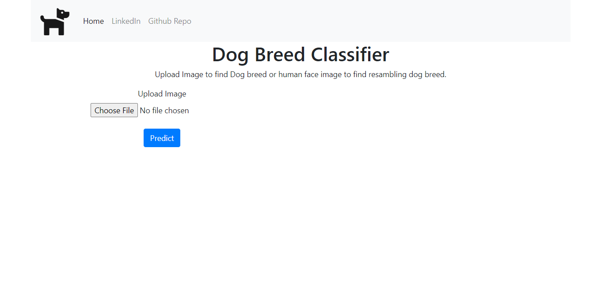
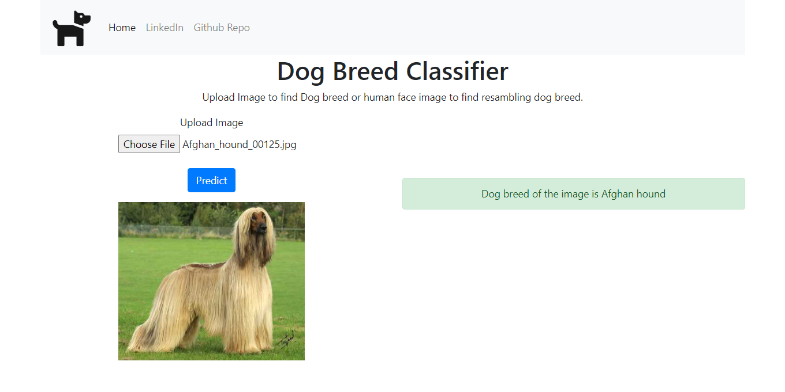
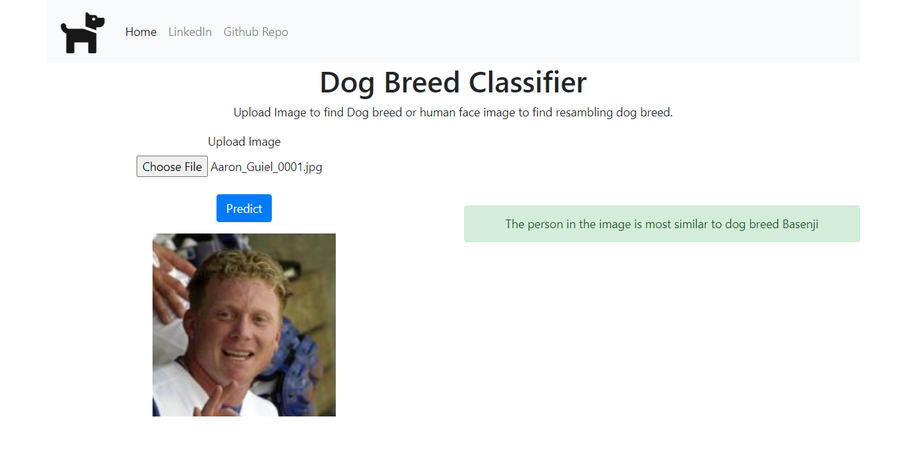
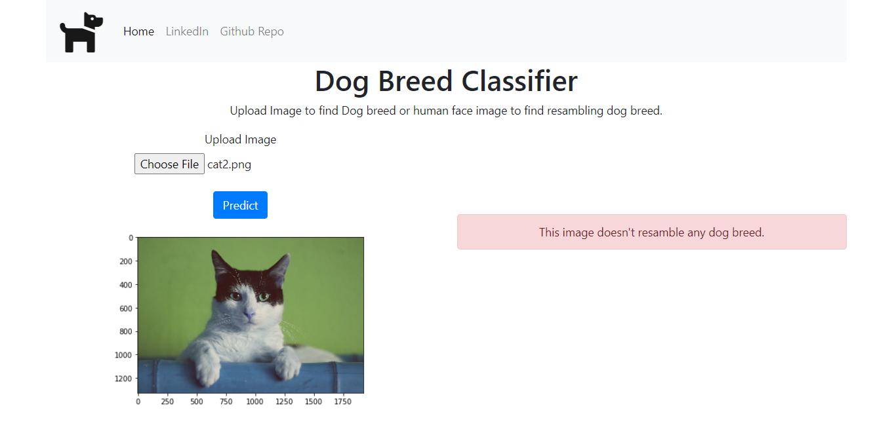

# Dog Breed Classifier Web App

## Udacity Data Scientist Nanodegree Capstone Project

# Table of Contents

1. [Instructions:](#instructions)
2. [File Description](#file-desc)
3. [Project Definition](#definition)
4. [Analysis](#analysis)
5. [Conclusion](#Concluison)

### Instructions: <a name="instructions"></a>

1.  Clone this repository.

    ```
    git clone https://github.com/ranamahmud/dog-breed-classifier-udacity-capstone.git
    ```

2.  Create and activate a new virtual environment.

    ```
    python3 -m virtualenv venv
    source venv/bin/activate
    ```

3.  Python used 3.7. You can use python 3.7+.
4.  Install the python packages using requirements.txt using

```
pip install -r requirements.txt
```

5.  Run the following commands to start the web app

6.  CD into the "web app" directory

```
cd webapp
```

7.  To run in the Windows operating system use the following command:

```
set FLASK_APP=app.py
flask run
```

8. To run on Linux use the following command:

```
export FLASK_APP=app.py
flask run
```

9.  The app will be running on http://127.0.0.1:5000/

# Project Definition <a name="definition"></a>

## Project Overview

Welcome to the Dog Breed Classifier using Convolutional Neural Networks (CNN) capstone project in the Data Scientist Nanodegree! In this project, I've built a pipeline that was used in a web app to process real-world, user-supplied images. Given an image of a dog, this web app will identify an estimate of the dog’s breed. If supplied with an image of a human, the app will identify the resembling dog breed.

## Problem Statement

For our web app, we've to write an algorithm that accepts a file path to an image and first determines whether the image contains a human, dog, or neither. Then,

1. If a dog is detected in the image, return the predicted breed.

2. If a human is detected in the image, return the resembling dog breed.

3. If neither is detected in the image, provide an output that indicates an error.

### Strategy for solving the problem

1. Build Humans and Dog detectors from the image.
2. Create a CNN to Classify Dog Breeds (from Scratch)
3. Use a CNN to Classify Dog Breeds (using Transfer Learning)
4. Create a CNN to Classify Dog Breeds (using Transfer Learning)
5. Choose the best CNN model for classification.
6. Write your Algorithm to detect dog breed or resembling dog breed or return an error.
7. Test the Algorithm.
8. Export the best model.
9. Build a flask web app using the model.
10. Test the model.

### Expected Solution

The expected solution will be a web application that can do the following things

1. Users can upload an image from the computer.
2. If a dog is detected in the image, it'll show the predicted breed.
3. If a human is detected in the image, it'll show the resembling dog breed.
4. If neither is detected in the image, it'll show an error.
5. If the prediction fails, it will show an error.

### Metrics

We'll use test accuracy as a measure of model performance. Based on the highest test accuracy we'll choose a CNN model for building the web app and algorithm.

# Analysis <a name="analysis"></a>

## Data Exploration

### Data Description

#### Dog Images

There are 133 total dog categories.
There are 8351 total dog images.

There are 6680 training dog images.
There are 835 validation dog images.
There are 836 test dog images.

#### Human Images

There are 13233 total human images.

#### Human Detector Performance

I've used OpenCV's implementation of Haar feature-based cascade classifiers to detect human faces in images.

100.0 percent of the first 100 images in human_files have a detected human face. 11.0% percent of the first 100 images in dog_files have a detected human face

#### Dog Detector Performance

I've used a pre-trained ResNet-50 model to detect dogs in images.

0.0 percentage of the images in human_files_short have a detected dog. 100.0 percentage of the images in dog_files_short have a detected dog

### Model Performance

CNN from scratch has a test performance of 3.1100%.

THE pre-trained VGG-16 CNN model has a test accuracy of 41.5072%.

CNN to Classify Dog Breeds using Resnet50(using transfer Learning) has a test accuracy of 79.6651.

Among the 3 models, CNN to Classify Dog Breeds using Resnet50 has the best performance. We'll use it to build our Algorithm for the web app.

## Data Visualization

### Data Exploration


Welsh Springer Spaniel
Brittany

From the above two images, we can see that dog breed pairs are often similar and difficult to differentiate.

# Conclusion <a name="conclusion"></a>

## Reflection

### Summary:

1. This web app uses dog_detector() for dog detection and face_detector() for face detection.
2. For dog breed detection CNN model with a pre-trained Resnet50 model is used.
3. In the flask web app we've used predict_human_dog() function to predict dog breed or resembling dog breed.
4. User uploads an image file on the app home page.
5. After uploading the user clicks on the Predict button.
6. When a dog breed is detected it shows the dog breed information.
7. When a human face is detected it shows the human face resembling dog breed.
8. For anything else it shows error message.

#### Web App Pages






### Two particular aspect with difficulty or interesting:

1. Implementation of the file upload in the flask website using ajax was difficult.
2. Testing the final algorithm was very much interesting.

## Improvement

One aspect of the implementation we can improve is making the human face detector more robust so that it can detect human when the human face is not visible.
We can use a pre-trained facenet model or other face detectors from open cv to detect humans.
Which might improve our web app and algorithm.
